<div class="pt-12">
  <h1 class="!text-5xl !leading-tight font-bold">
    <span class="text-red-400">Multiplayer Xmas</span><br>
    <span class="text-green-400">(Geo)-spatial</span> Supabase Edition
  </h1>
</div>

<div class="abs-bl m-6 flex items-center gap-2 text-white/80">
  <carbon:location-filled class="text-red-400"></carbon:location-filled>
  <span>Presented by <strong>Katerina Skroumpelou</strong></span>
</div>

<div class="abs-br m-6 text-6xl">
  <span class="animate-bounce inline-block">🎅</span>
  <span class="animate-pulse inline-block">🎄</span>
  <span class="animate-bounce inline-block" style="animation-delay: 0.5s">🎁</span>
</div>

<div class="absolute bottom-4 right-4 text-sm text-white/50">1</div>

<!--
Quick intro - I'm Katerina, working at Supabase, and I'm a GDE for both Angular and Google Maps. Today we're combining two of my favorite technologies to build something festive and fun - a real-time Christmas treasure hunt game!
-->

---
layout: image-right
image: https://images.unsplash.com/photo-1514888286974-6c03e2ca1dba?w=800
class: my-cool-content-on-the-left
---

# About Me

<div class="text-xl">

**Katerina Skroumpelou**

</div>

<v-clicks>

- <logos-supabase-icon></logos-supabase-icon> Software Engineer at **Supabase**
- <logos-google-maps></logos-google-maps> **Google Developer Expert** for Angular & Maps
- 🐱 Loves cats, chocolate, and being on stage
- <carbon-globe></carbon-globe> psyber.city | @psybercity

</v-clicks>

<div v-click class="mt-8 p-4 bg-green-900/30 rounded-lg border border-green-500/50">
  <carbon-idea class="text-yellow-400 inline"></carbon-idea> Today: Building a <span class="text-red-400 font-bold">real-time Christmas treasure hunt</span> with Supabase + Google Maps!
</div>

<style>
.my-cool-content-on-the-left h1 {
  background: linear-gradient(45deg, #c41e3a 30%, #0f7938 70%);
  -webkit-background-clip: text;
  -webkit-text-fill-color: transparent;
}
</style>

<div class="absolute bottom-4 right-4 text-sm text-white/50">2</div>

<!--
Quick intro - I'm Katerina, working at Supabase, and I'm a GDE for both Angular and Google Maps. Today we're combining two of my favorite technologies to build something festive and fun - a real-time Christmas treasure hunt game!
-->

---
layout: center
class: text-center
---

# What We're Building Today

<div class="text-6xl my-8 animate-pulse">
  🎁
</div>

<h2 class="!text-3xl text-green-400 mb-6">Santa's Lost Present</h2>

<div class="text-xl text-gray-300 mb-8">A real-time multiplayer geospatial treasure hunt</div>

<div class="grid grid-cols-2 gap-6 max-w-2xl mx-auto text-left">
  <div v-click class="p-4 bg-white/5 rounded-lg border border-white/10">
    <carbon-qr-code class="text-green-400 text-2xl mb-2"></carbon-qr-code>
    <div class="font-bold">Join via QR code</div>
    <div class="text-sm text-gray-400">Play on your phone</div>
  </div>
  <div v-click class="p-4 bg-white/5 rounded-lg border border-white/10">
    <carbon-location class="text-red-400 text-2xl mb-2"></carbon-location>
    <div class="font-bold">Drop guesses on a map</div>
    <div class="text-sm text-gray-400">Somewhere in London</div>
  </div>
  <div v-click class="p-4 bg-white/5 rounded-lg border border-white/10">
    <carbon-temperature-hot class="text-orange-400 text-2xl mb-2"></carbon-temperature-hot>
    <div class="font-bold">Hot/Cold feedback</div>
    <div class="text-sm text-gray-400">Blue = cold, Red = hot!</div>
  </div>
  <div v-click class="p-4 bg-white/5 rounded-lg border border-white/10">
    <carbon-game-console class="text-purple-400 text-2xl mb-2"></carbon-game-console>
    <div class="font-bold">3 Game Modes</div>
    <div class="text-sm text-gray-400">Normal, Elf, Polygon Hunt</div>
  </div>
</div>

<div class="absolute bottom-4 right-4 text-sm text-white/50">3</div>

<!--
Before we dive into the tech, let me show you what we're building. It's a multiplayer game where everyone in this room can play simultaneously. You'll see how Supabase and Google Maps work together to create a smooth, real-time experience.
-->

---
layout: two-cols
layoutClass: gap-8
---

# The Power of <span class="text-green-400">Supabase</span>

<div class="text-2xl font-light text-gray-300 mb-6">
Build in a weekend.<br>
<span class="text-green-400 font-bold">Scale to millions.</span>
</div>

<div v-click>

The **open-source** Postgres development platform developers love

</div>

<div class="mt-4 space-y-2">
  <div v-click class="flex items-center gap-2">
    <carbon-checkmark-filled class="text-green-400"></carbon-checkmark-filled>
    Production-ready Postgres backend
  </div>
  <div v-click class="flex items-center gap-2">
    <carbon-checkmark-filled class="text-green-400"></carbon-checkmark-filled>
    Everything integrated: Auth, Storage, Realtime, Edge Functions
  </div>
  <div v-click class="flex items-center gap-2">
    <carbon-checkmark-filled class="text-green-400"></carbon-checkmark-filled>
    Open source, no vendor lock-in
  </div>
  <div v-click class="flex items-center gap-2">
    <carbon-checkmark-filled class="text-green-400"></carbon-checkmark-filled>
    <span class="text-yellow-400">Your real backend = your test backend</span>
  </div>
</div>

::right::

<div class="h-full flex items-center justify-center">
  <div class="text-center">
    <logos-supabase-icon class="text-9xl mb-4"></logos-supabase-icon>
    <div class="text-6xl mt-6">
      <span v-click>🐘</span>
      <span v-click>⚡</span>
      <span v-click>🔐</span>
    </div>
  </div>
</div>

<div class="absolute bottom-4 right-4 text-sm text-white/50">4</div>

<!--
For those new to Supabase - it's everything you need for a backend, built on top of Postgres. The key difference from other platforms? It's all open source, which means you can self-host or migrate anytime. No lock-in. And because it uses standard Postgres, you get 30+ years of database stability and all the extensions you could want.
-->

---

# Supabase: What's Inside? <carbon-box class="inline text-green-400"></carbon-box>

<div class="grid grid-cols-2 gap-4 mt-8">

<div v-click class="p-4 bg-gradient-to-br from-green-900/40 to-green-900/10 rounded-lg border border-green-500/30">
  <div class="flex items-center gap-2 mb-2">
    <carbon-data-base class="text-green-400 text-xl"></carbon-data-base>
    <span class="font-bold text-green-400">Database</span>
  </div>
  <div class="text-sm text-gray-300">Full Postgres with 50+ extensions (PostGIS, pgvector, etc.)</div>
</div>

<div v-click class="p-4 bg-gradient-to-br from-red-900/40 to-red-900/10 rounded-lg border border-red-500/30">
  <div class="flex items-center gap-2 mb-2">
    <carbon-locked class="text-red-400 text-xl"></carbon-locked>
    <span class="font-bold text-red-400">Auth</span>
  </div>
  <div class="text-sm text-gray-300">Email/password, OAuth, Magic Links, Enterprise SSO</div>
</div>

<div v-click class="p-4 bg-gradient-to-br from-blue-900/40 to-blue-900/10 rounded-lg border border-blue-500/30">
  <div class="flex items-center gap-2 mb-2">
    <carbon-cloud-upload class="text-blue-400 text-xl"></carbon-cloud-upload>
    <span class="font-bold text-blue-400">Storage</span>
  </div>
  <div class="text-sm text-gray-300">S3-compatible file storage with RLS</div>
</div>

<div v-click class="p-4 bg-gradient-to-br from-purple-900/40 to-purple-900/10 rounded-lg border border-purple-500/30">
  <div class="flex items-center gap-2 mb-2">
    <carbon-function class="text-purple-400 text-xl"></carbon-function>
    <span class="font-bold text-purple-400">Edge Functions</span>
  </div>
  <div class="text-sm text-gray-300">Server-side TypeScript/Deno at the edge</div>
</div>

<div v-click class="p-4 bg-gradient-to-br from-yellow-900/40 to-yellow-900/10 rounded-lg border border-yellow-500/30">
  <div class="flex items-center gap-2 mb-2">
    <carbon-lightning class="text-yellow-400 text-xl"></carbon-lightning>
    <span class="font-bold text-yellow-400">Realtime</span>
  </div>
  <div class="text-sm text-gray-300">WebSockets for live updates & multiplayer</div>
</div>

<div v-click class="p-4 bg-gradient-to-br from-cyan-900/40 to-cyan-900/10 rounded-lg border border-cyan-500/30">
  <div class="flex items-center gap-2 mb-2">
    <carbon-api class="text-cyan-400 text-xl"></carbon-api>
    <span class="font-bold text-cyan-400">Auto-generated APIs</span>
  </div>
  <div class="text-sm text-gray-300">REST and GraphQL from your schema</div>
</div>

</div>

<div class="absolute bottom-4 right-4 text-sm text-white/50">5</div>

<!--
Here's what you get with Supabase. For our game today, we're using three key features: Realtime for live updates, Edge Functions for game logic validation, and PostGIS for geospatial queries. But the beauty is - all of this runs locally too. Same Docker images. That's production parity you can trust.
-->

---

# The Supabase Features We're Using <span class="text-red-400">🎯</span>

<div class="grid grid-cols-3 gap-6 mt-8">

<div v-click class="text-center">
  <div class="w-20 h-20 mx-auto mb-4 rounded-full bg-yellow-500/20 flex items-center justify-center">
    <carbon-lightning class="text-4xl text-yellow-400"></carbon-lightning>
  </div>
  <h3 class="text-xl font-bold text-yellow-400 mb-2">1. Realtime Channels</h3>
  <ul class="text-sm text-left text-gray-300 space-y-1">
    <li>Live sync of player guesses</li>
    <li>Instant game state updates</li>
    <li>Built on Postgres logical replication</li>
  </ul>
</div>

<div v-click class="text-center">
  <div class="w-20 h-20 mx-auto mb-4 rounded-full bg-purple-500/20 flex items-center justify-center">
    <carbon-function class="text-4xl text-purple-400"></carbon-function>
  </div>
  <h3 class="text-xl font-bold text-purple-400 mb-2">2. Edge Functions</h3>
  <ul class="text-sm text-left text-gray-300 space-y-1">
    <li>Validate guesses server-side</li>
    <li>Calculate distances from target</li>
    <li>Rate limiting and security</li>
  </ul>
</div>

<div v-click class="text-center">
  <div class="w-20 h-20 mx-auto mb-4 rounded-full bg-green-500/20 flex items-center justify-center">
    <carbon-location class="text-4xl text-green-400"></carbon-location>
  </div>
  <h3 class="text-xl font-bold text-green-400 mb-2">3. PostGIS Extension</h3>
  <ul class="text-sm text-left text-gray-300 space-y-1">
    <li>Efficient geo coordinate storage</li>
    <li>Fast spatial queries at scale</li>
    <li>Distance & polygon calculations</li>
  </ul>
</div>

</div>

<div v-click class="mt-8 text-center">
  <div class="inline-flex items-center gap-2 px-6 py-3 bg-green-900/30 rounded-full border border-green-500/50">
    <carbon-idea class="text-yellow-400"></carbon-idea>
    <span>All three work together for <span class="text-green-400 font-bold">real-time geospatial magic!</span></span>
  </div>
</div>

<div class="absolute bottom-4 right-4 text-sm text-white/50">6</div>

<!--
Let me break down the three Supabase features powering our game. Realtime gives us instant updates - when anyone drops a pin, everyone sees it immediately. Edge Functions handle the game logic - we can't trust the client to calculate distances fairly! And PostGIS is Postgres's geospatial extension - it's incredibly efficient for location-based queries.
-->

---
layout: two-cols
layoutClass: gap-8
---

# Realtime in Action <carbon-lightning class="inline text-yellow-400"></carbon-lightning>

```ts {all|2-3|4-11|12}
// Subscribe to game state changes
const channel = supabase
  .channel('game-state')
  .on('postgres_changes',
    {
      event: '*',
      schema: 'public',
      table: 'guesses'
    },
    (payload) => {
      updatePlayerMarkers(payload.new)
    }
  )
  .subscribe()
```

<div v-click class="mt-4 p-3 bg-yellow-900/20 rounded border border-yellow-500/30 text-sm">
  <carbon-flow class="text-yellow-400 inline mr-2"></carbon-flow>
  <strong>Real Postgres replication</strong> → WebSocket → Your app
</div>

::right::

<div class="h-full flex flex-col justify-center">
  <div v-click class="space-y-4">
    <div class="flex items-center gap-3">
      <div class="w-12 h-12 rounded-full bg-green-500/20 flex items-center justify-center">
        <span class="text-green-400">👤</span>
      </div>
      <div class="flex-1 h-2 bg-green-500/30 rounded animate-pulse"></div>
      <div class="w-12 h-12 rounded-full bg-blue-500/20 flex items-center justify-center">
        <span class="text-blue-400">🗄️</span>
      </div>
    </div>
    <div class="text-center text-sm text-gray-400">Player submits guess</div>
    <div class="flex items-center gap-3">
      <div class="w-12 h-12 rounded-full bg-blue-500/20 flex items-center justify-center">
        <span class="text-blue-400">🗄️</span>
      </div>
      <div class="flex-1 h-2 bg-yellow-500/30 rounded animate-pulse" style="animation-delay: 0.3s"></div>
      <div class="w-12 h-12 rounded-full bg-yellow-500/20 flex items-center justify-center">
        <span class="text-yellow-400">⚡</span>
      </div>
    </div>
    <div class="text-center text-sm text-gray-400">Realtime broadcasts</div>
    <div class="flex items-center gap-3">
      <div class="w-12 h-12 rounded-full bg-yellow-500/20 flex items-center justify-center">
        <span class="text-yellow-400">⚡</span>
      </div>
      <div class="flex-1 h-2 bg-purple-500/30 rounded animate-pulse" style="animation-delay: 0.6s"></div>
      <div class="flex gap-1">
        <div class="w-8 h-8 rounded-full bg-purple-500/20 flex items-center justify-center">
          <span class="text-purple-400 text-sm">👤</span>
        </div>
        <div class="w-8 h-8 rounded-full bg-purple-500/20 flex items-center justify-center">
          <span class="text-purple-400 text-sm">👤</span>
        </div>
        <div class="w-8 h-8 rounded-full bg-purple-500/20 flex items-center justify-center">
          <span class="text-purple-400 text-sm">👤</span>
        </div>
      </div>
    </div>
    <div class="text-center text-sm text-gray-400">All players update instantly!</div>
  </div>
</div>

<div class="absolute bottom-4 right-4 text-sm text-white/50">7</div>

<!--
Here's how simple Realtime is. You subscribe to changes on your database tables, and Supabase streams them to you via WebSockets. Under the hood, it's using Postgres logical replication - the same technology that powers database replicas. When a player submits a guess, it hits our Edge Function, gets stored in Postgres, and Realtime broadcasts it to everyone instantly.
-->

---

# PostGIS: Geospatial Superpowers <carbon-earth-filled class="inline text-green-400"></carbon-earth-filled>

<div class="grid grid-cols-2 gap-8 mt-6">

<div>

### Why PostGIS?

<v-clicks>

- <carbon-data-structured class="text-green-400 inline"></carbon-data-structured> Efficient storage of geographic types
  - Point, Polygon, LineString
- <carbon-flash class="text-yellow-400 inline"></carbon-flash> Spatial indexing for **blazing fast** queries
- <carbon-rule class="text-blue-400 inline"></carbon-rule> Real Earth geometry calculations
- <carbon-area class="text-purple-400 inline"></carbon-area> Polygon containment checks

</v-clicks>

</div>

<div v-click>

```sql
-- Find guesses within 1km of target
SELECT * FROM guesses
WHERE ST_Distance(
  location,
  ST_Point(-0.0754, 51.5197)::geography
) <= 1000;
```

<div class="mt-4 text-sm text-gray-400">
  <carbon-location-filled class="text-red-400 inline"></carbon-location-filled> Spitalfields Market, London
</div>

</div>

</div>

<div v-click class="mt-6 p-4 bg-gradient-to-r from-green-900/30 to-blue-900/30 rounded-lg border border-green-500/30">
  <div class="flex items-center gap-4">
    <div class="text-4xl">🌍</div>
    <div>
      <div class="font-bold text-green-400">PostGIS = Game Changer</div>
      <div class="text-sm text-gray-300">Store lat/lng as geography type, query millions of points efficiently with spatial indexes</div>
    </div>
  </div>
</div>

<div class="absolute bottom-4 right-4 text-sm text-white/50">8</div>

<!--
PostGIS is a game-changer for location-based apps. Instead of storing lat/long as two decimal fields, you store them as a geography type. PostGIS can then use spatial indexes to query millions of points efficiently. For our game, we use it to calculate distances from the target and check if points fall within a polygon.
-->

---
layout: center
class: text-center
background: https://images.unsplash.com/photo-1569336415962-a4bd9f69cd83?w=1920
---

<div class="backdrop-blur-sm bg-black/50 p-12 rounded-2xl">

# Now... Let's Talk About

<div class="text-6xl my-6">
  <logos-google-maps class="text-8xl"></logos-google-maps>
</div>

<h2 class="!text-4xl text-white/90 mt-4">Google Maps Platform!</h2>

<div v-click class="mt-6 text-xl text-gray-300 italic">
  "The platform you didn't know could do all this"
</div>

</div>

<div class="absolute bottom-4 right-4 text-sm text-white/50">9</div>

<!--
Okay, now for the fun part - Google Maps Platform! Most developers know Google Maps for basic map display, but it's evolved into an incredibly powerful platform. Let me show you what's possible.
-->

---

# What Can You Do With Google Maps Platform? <logos-google-maps class="inline"></logos-google-maps>

<div class="text-xl text-gray-300 mb-6">Beyond "just a map":</div>

<div class="grid grid-cols-3 gap-4">

<div v-click class="p-4 bg-white/5 rounded-lg border border-white/10 hover:border-blue-500/50 transition">
  <div class="text-3xl text-blue-400 mb-2">🏙️</div>
  <div class="font-bold">Photorealistic 3D</div>
  <div class="text-sm text-gray-400">Cities with Street View imagery</div>
</div>

<div v-click class="p-4 bg-white/5 rounded-lg border border-white/10 hover:border-purple-500/50 transition">
  <div class="text-3xl text-purple-400 mb-2">🎨</div>
  <div class="font-bold">Custom Styling</div>
  <div class="text-sm text-gray-400">Match your brand</div>
</div>

<div v-click class="p-4 bg-white/5 rounded-lg border border-white/10 hover:border-red-500/50 transition">
  <div class="text-3xl text-red-400 mb-2">📍</div>
  <div class="font-bold">Advanced Markers</div>
  <div class="text-sm text-gray-400">HTML/CSS powered</div>
</div>

<div v-click class="p-4 bg-white/5 rounded-lg border border-white/10 hover:border-green-500/50 transition">
  <div class="text-3xl text-green-400 mb-2">🧊</div>
  <div class="font-bold">WebGL Overlays</div>
  <div class="text-sm text-gray-400">Custom 3D graphics</div>
</div>

<div v-click class="p-4 bg-white/5 rounded-lg border border-white/10 hover:border-yellow-500/50 transition">
  <div class="text-3xl text-yellow-400 mb-2">📐</div>
  <div class="font-bold">Geometry Calcs</div>
  <div class="text-sm text-gray-400">Distances, polygons, routes</div>
</div>

<div v-click class="p-4 bg-white/5 rounded-lg border border-white/10 hover:border-cyan-500/50 transition">
  <div class="text-3xl text-cyan-400 mb-2">🤖</div>
  <div class="font-bold">AI Integration</div>
  <div class="text-sm text-gray-400">Vertex AI and MCP</div>
</div>

</div>

<div class="absolute bottom-4 right-4 text-sm text-white/50">10</div>

<!--
Google Maps Platform has evolved dramatically. You can render photorealistic 3D cities, create custom styled maps that match your brand, add interactive 3D objects with WebGL, and now even integrate with AI through Vertex AI and Model Context Protocol. Let's dive into the features we're using in the game.
-->

---
layout: two-cols
layoutClass: gap-8
---

# Feature #1: Advanced Markers

<div class="text-gray-300 mb-4">Dynamic, customizable markers that are <span class="text-green-400 font-bold">fast</span> and <span class="text-red-400 font-bold">beautiful</span></div>

```ts {all|2-5|7-8}
const marker = new google.maps.marker
  .AdvancedMarkerElement({
    map,
    position: { lat: 51.5197, lng: -0.0754 },
    content: markerContent, // Custom HTML!
    title: player.nickname
});

// Change color based on distance
markerContent.style.background =
  getMarkerColor(distance);
```

<div class="mt-4 space-y-2 text-sm">
  <div v-click class="flex items-center gap-2">
    <carbon-checkmark class="text-green-400"></carbon-checkmark>
    Render custom HTML/CSS
  </div>
  <div v-click class="flex items-center gap-2">
    <carbon-checkmark class="text-green-400"></carbon-checkmark>
    Dynamic updates without recreating
  </div>
  <div v-click class="flex items-center gap-2">
    <carbon-checkmark class="text-green-400"></carbon-checkmark>
    Hardware-accelerated rendering
  </div>
  <div v-click class="flex items-center gap-2">
    <carbon-checkmark class="text-green-400"></carbon-checkmark>
    Click events and interactions
  </div>
</div>

::right::

<div class="h-full flex items-center justify-center">
  <div v-click class="relative">
    <!-- Mock map with markers -->
    <div class="w-64 h-64 bg-gray-800 rounded-lg overflow-hidden relative border border-gray-600">
      <div class="absolute inset-0 opacity-20">
        <div class="absolute top-1/4 left-1/4 w-32 h-32 border border-gray-500 rounded"></div>
        <div class="absolute top-1/3 left-1/3 w-20 h-20 border border-gray-500"></div>
      </div>
      <!-- Markers with gradient colors -->
      <div class="absolute top-8 left-12 w-8 h-8 rounded-full bg-blue-500 flex items-center justify-center text-xs font-bold shadow-lg animate-bounce" style="animation-duration: 2s">
        <span class="text-white">🧊</span>
      </div>
      <div class="absolute top-16 right-8 w-8 h-8 rounded-full bg-cyan-400 flex items-center justify-center text-xs font-bold shadow-lg">
        <span>❄️</span>
      </div>
      <div class="absolute bottom-16 left-8 w-8 h-8 rounded-full bg-yellow-500 flex items-center justify-center text-xs font-bold shadow-lg">
        <span>🌡️</span>
      </div>
      <div class="absolute bottom-8 right-16 w-8 h-8 rounded-full bg-orange-500 flex items-center justify-center text-xs font-bold shadow-lg">
        <span>🔥</span>
      </div>
      <div class="absolute top-1/2 left-1/2 transform -translate-x-1/2 -translate-y-1/2 w-10 h-10 rounded-full bg-red-500 flex items-center justify-center text-xs font-bold shadow-lg animate-pulse">
        <span>🎁</span>
      </div>
    </div>
    <div class="mt-4 text-center text-sm text-gray-400">
      Blue = Cold | Red = Hot!
    </div>
  </div>
</div>

<div class="absolute bottom-4 right-4 text-sm text-white/50">11</div>

<!--
Advanced Markers let you use HTML and CSS for your map markers. In our game, each player gets a marker with their nickname, and the background color changes from blue to red based on how close they are to the target. It's all hardware-accelerated, so even with 100 players, it stays smooth.
-->

---

# Feature #2: Geometry Library <carbon-rule class="inline text-yellow-400"></carbon-rule>

<div class="text-xl text-gray-300 mb-6">Mathematical operations on geographic coordinates</div>

<div class="grid grid-cols-2 gap-8">

<div v-click>

### Distance Calculation

```ts
// Calculate distance between two points
const distance = google.maps.geometry
  .spherical.computeDistanceBetween(
    playerGuess,
    targetLocation
  ); // Returns meters
```

<div class="mt-2 p-2 bg-blue-900/30 rounded text-sm">
  <carbon-information class="text-blue-400 inline mr-1"></carbon-information>
  Uses <span class="text-yellow-400">Haversine formula</span> for Earth's curvature
</div>

</div>

<div v-click>

### Polygon Containment

```ts
// Check if point is inside polygon
const isInside = google.maps.geometry
  .poly.containsLocation(
    playerGuess,
    polygonShape
  ); // Returns true/false
```

<div class="mt-2 p-2 bg-green-900/30 rounded text-sm">
  <carbon-information class="text-green-400 inline mr-1"></carbon-information>
  <span class="text-yellow-400">Ray casting algorithm</span> under the hood
</div>

</div>

</div>

<div v-click class="mt-8 text-center">
  <div class="inline-block px-6 py-3 bg-gradient-to-r from-green-900/50 to-blue-900/50 rounded-full">
    <carbon-earth class="text-green-400 inline mr-2"></carbon-earth>
    <span class="font-bold">Powered by real spherical geometry</span> - accurate calculations on Earth's surface
  </div>
</div>

<div class="absolute bottom-4 right-4 text-sm text-white/50">12</div>

<!--
The Geometry library handles the math so you don't have to. For distance-based gameplay, we use computeDistanceBetween which uses the Haversine formula - it accounts for Earth's curvature. For Polygon Hunt mode, containsLocation checks if a point is inside our gift-shaped polygon. Both are incredibly fast and accurate.
-->

---

# Feature #3: WebGL Overlay View <carbon-cube class="inline text-purple-400"></carbon-cube>

<div class="text-xl text-gray-300 mb-4">Render custom 3D graphics on the map</div>

```ts {all|1|3-9|11-14}
const webglOverlay = new google.maps.WebGLOverlayView();

webglOverlay.onDraw = ({ gl, transformer }) => {
  // Georeference your 3D content
  const matrix = transformer.fromLatLngAltitude({
    lat: 51.5197,
    lng: -0.0754,
    altitude: 100
  });

  // Render 3D present at location with Three.js
  camera.projectionMatrix = new THREE.Matrix4()
    .fromArray(matrix);
  renderer.render(scene, camera);
};
```

<div v-click class="mt-4 flex gap-4">
  <div class="flex-1 p-3 bg-purple-900/30 rounded border border-purple-500/30 text-center">
    <carbon-cube class="text-3xl text-purple-400 mb-1"></carbon-cube>
    <div class="text-sm">3D Objects</div>
  </div>
  <div class="flex-1 p-3 bg-pink-900/30 rounded border border-pink-500/30 text-center">
    <carbon-star class="text-3xl text-pink-400 mb-1"></carbon-star>
    <div class="text-sm">Particle Effects</div>
  </div>
  <div class="flex-1 p-3 bg-cyan-900/30 rounded border border-cyan-500/30 text-center">
    <carbon-analytics class="text-3xl text-cyan-400 mb-1"></carbon-analytics>
    <div class="text-sm">Visualizations</div>
  </div>
</div>

<div class="absolute bottom-4 right-4 text-sm text-white/50">13</div>

<!--
This is where it gets really cool. WebGL Overlay View lets you add custom 3D graphics to your map. When someone wins our game, we show a 3D rotating present at the target location using Three.js. The transformer function georegister your 3D objects so they stay locked to map coordinates as users pan and zoom.
-->

---
layout: two-cols
layoutClass: gap-8
---

# Feature #4: Map Styling with Map IDs

<div class="text-gray-300 mb-4">Create custom themes <span class="text-yellow-400">without touching code</span></div>

```ts
const map = new google.maps.Map(
  mapRef.current,
  {
    center: LONDON_CENTER,
    zoom: 10,
    mapId: 'YOUR_CUSTOM_MAP_ID' // That's it!
  }
);
```

<div class="mt-4 space-y-2 text-sm">
  <div v-click class="flex items-center gap-2">
    <carbon-cloud class="text-blue-400"></carbon-cloud>
    Design in Google Cloud Console
  </div>
  <div v-click class="flex items-center gap-2">
    <carbon-devices class="text-green-400"></carbon-devices>
    Reusable across platforms
  </div>
  <div v-click class="flex items-center gap-2">
    <carbon-reset class="text-yellow-400"></carbon-reset>
    Live updates without redeployment
  </div>
  <div v-click class="flex items-center gap-2">
    <carbon-contrast class="text-purple-400"></carbon-contrast>
    Light/dark mode support
  </div>
</div>

::right::

<div v-click class="h-full flex items-center">
  <div class="w-full p-4 bg-gradient-to-br from-red-900/30 to-green-900/30 rounded-lg border border-white/20">
    <div class="text-center mb-3 text-lg font-bold text-yellow-400">
      <carbon-paint-brush class="inline mr-2"></carbon-paint-brush>
      Christmas Theme?
    </div>
    <div class="space-y-2 text-sm">
      <div class="flex items-center gap-2">
        <div class="w-4 h-4 rounded bg-red-600"></div>
        <span>Roads in festive red</span>
      </div>
      <div class="flex items-center gap-2">
        <div class="w-4 h-4 rounded bg-green-700"></div>
        <span>Parks in holiday green</span>
      </div>
      <div class="flex items-center gap-2">
        <div class="w-4 h-4 rounded bg-blue-200"></div>
        <span>Water as icy blue</span>
      </div>
      <div class="flex items-center gap-2">
        <div class="w-4 h-4 rounded bg-yellow-400"></div>
        <span>Labels in gold</span>
      </div>
    </div>
    <div class="mt-3 text-center text-xs text-gray-400">
      All visual, no code changes needed!
    </div>
  </div>
</div>

<div class="absolute bottom-4 right-4 text-sm text-white/50">14</div>

<!--
Map IDs let you create custom styled maps in the Cloud Console and reference them by ID. Want a Christmas theme? Change colors to red and green, add snow effect - all visual, no code. The best part? You can update the style and every app using that Map ID picks up the changes automatically. No redeployment needed.
-->

---

# Feature #5: 3D Maps (Photorealistic Tiles) <carbon-3d-mpr-toggle class="inline text-cyan-400"></carbon-3d-mpr-toggle>

<div class="text-xl text-gray-300 mb-4">Fly through cities with photorealistic 3D buildings</div>

<div class="grid grid-cols-2 gap-8">

<div>

```ts {all|1-2|4-12|14-18}
const { Map3DElement } = await google.maps
  .importLibrary('maps3d');

const map3d = new Map3DElement({
  center: {
    lat: 51.5197,
    lng: -0.0754,
    altitude: 50
  },
  tilt: 65,
  heading: 0,
  mode: 'SATELLITE'
});

// Animate camera fly-around
map3d.flyCameraAround({
  camera: flyAroundCamera,
  durationMillis: 60000,
  rounds: 2
});
```

</div>

<div v-click class="flex items-center justify-center">
  <div class="text-center">
    <div class="text-8xl mb-4">🌆</div>
    <div class="text-lg font-bold text-cyan-400">Google Earth in Your Browser</div>
    <div class="text-sm text-gray-400 mt-2">
      Same technology, now in your web apps!
    </div>
    <div class="mt-4 text-xs text-gray-500">
      <carbon-location-filled class="inline text-red-400"></carbon-location-filled> Spitalfields Market fly-around demo
    </div>
  </div>
</div>

</div>

<div class="absolute bottom-4 right-4 text-sm text-white/50">15</div>

<!--
3D Maps use Google's photorealistic 3D tiles - actual imagery draped over 3D building models. You can fly through cities, tilt and rotate the camera, and create cinematic experiences. I'm using this for a bonus demo where we fly around Spitalfields Market in London. It's the same technology behind Google Earth, now available in your web apps.
-->

---

# The Magic: Google Maps + AI <carbon-machine-learning class="inline text-cyan-400"></carbon-machine-learning>

<div class="text-xl text-gray-300 mb-6">Three ways AI enhances Google Maps development</div>

<div class="grid grid-cols-3 gap-6">

<div v-click class="p-4 bg-gradient-to-b from-purple-900/40 to-transparent rounded-lg border border-purple-500/30">
  <div class="text-4xl mb-3">🔌</div>
  <h3 class="font-bold text-purple-400 mb-2">1. Model Context Protocol</h3>
  <ul class="text-sm text-gray-300 space-y-1">
    <li>Ask questions, get accurate answers</li>
    <li>Code samples for your use case</li>
    <li>Claude, Cursor, and more</li>
  </ul>
</div>

<div v-click class="p-4 bg-gradient-to-b from-blue-900/40 to-transparent rounded-lg border border-blue-500/30">
  <div class="text-4xl mb-3">🧠</div>
  <h3 class="font-bold text-blue-400 mb-2">2. Vertex AI Grounding</h3>
  <ul class="text-sm text-gray-300 space-y-1">
    <li>Ground Gemini with geospatial data</li>
    <li>Access 250M+ places</li>
    <li>Location-aware AI responses</li>
  </ul>
</div>

<div v-click class="p-4 bg-gradient-to-b from-green-900/40 to-transparent rounded-lg border border-green-500/30">
  <div class="text-4xl mb-3">👁️</div>
  <h3 class="font-bold text-green-400 mb-2">3. Imagery Insights</h3>
  <ul class="text-sm text-gray-300 space-y-1">
    <li>Analyze Street View with AI</li>
    <li>Identify objects, assess conditions</li>
    <li>Infrastructure monitoring</li>
  </ul>
</div>

</div>

<div v-click class="mt-6 p-4 bg-yellow-900/20 rounded-lg border border-yellow-500/30 text-center">
  <carbon-idea class="text-yellow-400 text-2xl inline mr-2"></carbon-idea>
  <span class="text-lg">The future: AI that <span class="text-yellow-400 font-bold">understands geography and location context</span></span>
</div>

<div class="absolute bottom-4 right-4 text-sm text-white/50">16</div>

<!--
This is the future of development. Google Maps now has MCP integration - that's Model Context Protocol - which lets AI assistants like Claude access official Google Maps documentation in real-time. Instead of hoping the AI's training data is current, it can fetch the latest docs. Combined with Vertex AI grounding, you can build AI apps that understand geography and location context.
-->

---
layout: two-cols
layoutClass: gap-8
---

# Google Maps MCP in Action

<div class="text-gray-300 mb-4">I used it to build this presentation!</div>

```text
"Retrieve Google Maps Platform
documentation on:
- Advanced Markers with custom HTML
- Geometry library distance calculations
- WebGL Overlay View
- 3D Maps camera animations"
```

<div v-click class="mt-4 p-3 bg-green-900/30 rounded border border-green-500/30">
  <carbon-arrow-right class="text-green-400 inline mr-2"></carbon-arrow-right>
  Gets latest docs + code samples + best practices
</div>

<div v-click class="mt-4 text-sm">
  <div class="font-bold text-gray-300 mb-2">Available in:</div>
  <div class="flex gap-2">
    <span class="px-2 py-1 bg-purple-900/50 rounded text-purple-300 text-xs">Claude Desktop</span>
    <span class="px-2 py-1 bg-blue-900/50 rounded text-blue-300 text-xs">Cursor AI</span>
    <span class="px-2 py-1 bg-gray-800 rounded text-gray-300 text-xs">Any MCP tool</span>
  </div>
</div>

::right::

<div v-click class="h-full flex items-center justify-center">
  <div class="p-6 bg-gradient-to-br from-purple-900/40 to-blue-900/40 rounded-xl border border-purple-500/30">
    <div class="flex items-center gap-4 mb-4">
      <div class="text-5xl">🤖</div>
      <div class="text-5xl">+</div>
      <logos-google-maps class="text-5xl"></logos-google-maps>
    </div>
    <div class="text-center text-lg font-bold text-purple-300">
      AI-Powered Development
    </div>
    <div class="text-center text-sm text-gray-400 mt-2">
      Like having a Google Maps expert<br>sitting next to you!
    </div>
  </div>
</div>

<div class="absolute bottom-4 right-4 text-sm text-white/50">17</div>

<!--
Full disclosure - I actually used the Google Maps MCP to help prepare this presentation! Instead of digging through docs, I asked Claude to retrieve information about specific features, and it pulled the latest documentation, complete with code samples. It's like having a Google Maps expert sitting next to you while you code.
-->

---
layout: center
class: text-center
background: https://images.unsplash.com/photo-1512389142860-9c449e58a814?w=1920
---

<div class="backdrop-blur-sm bg-black/60 p-12 rounded-2xl">

# Let's See It In Action! <span class="animate-bounce inline-block">🎮</span>

<div class="text-3xl my-6 text-yellow-400 font-bold">Time to play Santa's Lost Present</div>

<div class="grid grid-cols-5 gap-4 max-w-3xl mx-auto mt-8">
  <div v-click class="text-center">
    <div class="w-16 h-16 mx-auto mb-2 rounded-full bg-white/10 flex items-center justify-center text-3xl">📱</div>
    <div class="text-sm">Scan QR code</div>
  </div>
  <div v-click class="text-center">
    <div class="w-16 h-16 mx-auto mb-2 rounded-full bg-white/10 flex items-center justify-center text-3xl">🎅</div>
    <div class="text-sm">Get nickname</div>
  </div>
  <div v-click class="text-center">
    <div class="w-16 h-16 mx-auto mb-2 rounded-full bg-white/10 flex items-center justify-center text-3xl">📍</div>
    <div class="text-sm">Drop a pin</div>
  </div>
  <div v-click class="text-center">
    <div class="w-16 h-16 mx-auto mb-2 rounded-full bg-white/10 flex items-center justify-center text-3xl">🌡️</div>
    <div class="text-sm">Watch color</div>
  </div>
  <div v-click class="text-center">
    <div class="w-16 h-16 mx-auto mb-2 rounded-full bg-white/10 flex items-center justify-center text-3xl">🏆</div>
    <div class="text-sm">Win!</div>
  </div>
</div>

<div v-click class="mt-8 text-xl text-green-400">
  <carbon-trophy class="inline mr-2"></carbon-trophy>
  First to get within <span class="font-bold">1km</span> wins!
</div>

</div>

<div class="absolute bottom-4 right-4 text-sm text-white/50">18</div>

<!--
Alright, let's play! Everyone grab your phones and scan this QR code. You'll be assigned a festive nickname - something like JollyElfHunter or FrostyGiftSeeker. Once you're in, tap anywhere on the map to place your guess. Your marker will change color - blue means cold, red means hot. The target is somewhere in London. Who can find it first?
-->

---

# Behind the Scenes: How It Works <carbon-flow class="inline text-blue-400"></carbon-flow>

<div class="grid grid-cols-2 gap-8 mt-6">

<div>



</div>

<div v-click>

```mermaid {scale: 0.7, theme: 'dark'}
flowchart TD
    A[📱 Player Phone] -->|tap map| B[⚡ Edge Function]
    B -->|validate & store| C[🐘 Postgres + PostGIS]
    C -->|broadcast| D[📡 Realtime]
    D -->|WebSocket| E[🖥️ Admin Dashboard]
    D -->|WebSocket| A

    style A fill:#4ade80,color:#000
    style B fill:#a855f7,color:#fff
    style C fill:#3b82f6,color:#fff
    style D fill:#facc15,color:#000
    style E fill:#ef4444,color:#fff
```

### Key Points

<div class="space-y-3 mt-4">
  <div class="flex items-start gap-2">
    <carbon-checkmark-filled class="text-green-400 mt-1"></carbon-checkmark-filled>
    <div>
      <span class="font-bold text-green-400">No polling!</span>
      <span class="text-gray-300"> Realtime uses WebSockets</span>
    </div>
  </div>
  <div class="flex items-start gap-2">
    <carbon-checkmark-filled class="text-purple-400 mt-1"></carbon-checkmark-filled>
    <div>
      <span class="font-bold text-purple-400">Server validates</span>
      <span class="text-gray-300"> distances (no cheating!)</span>
    </div>
  </div>
  <div class="flex items-start gap-2">
    <carbon-checkmark-filled class="text-blue-400 mt-1"></carbon-checkmark-filled>
    <div>
      <span class="font-bold text-blue-400">PostGIS indexing</span>
      <span class="text-gray-300"> keeps queries fast</span>
    </div>
  </div>
  <div class="flex items-start gap-2">
    <carbon-checkmark-filled class="text-yellow-400 mt-1"></carbon-checkmark-filled>
    <div>
      <span class="font-bold text-yellow-400">Geometry library</span>
      <span class="text-gray-300"> for accurate calcs</span>
    </div>
  </div>
</div>

</div>

</div>

<div class="absolute bottom-4 right-4 text-sm text-white/50">19</div>

<!--
Let me show you what's happening under the hood. When you tap the map, your guess goes to a Supabase Edge Function that validates it and calculates the distance using PostGIS. That gets stored in Postgres, and Realtime broadcasts the update to everyone - including the admin dashboard I'm showing on the big screen. Google Maps renders all the markers with their color-coded distances.
-->

---

# Three Game Modes Explained <carbon-game-console class="inline text-purple-400"></carbon-game-console>

<div class="grid grid-cols-3 gap-6 mt-8">

<div v-click class="p-6 bg-gradient-to-b from-blue-900/40 to-transparent rounded-xl border border-blue-500/30 text-center">
  <div class="text-5xl mb-4">🎯</div>
  <h3 class="text-xl font-bold text-blue-400 mb-3">Normal Mode</h3>
  <ul class="text-sm text-left text-gray-300 space-y-2">
    <li><carbon-location class="inline text-blue-400"></carbon-location> Fixed target location</li>
    <li><carbon-trophy class="inline text-yellow-400"></carbon-trophy> First to get within 1km wins</li>
    <li><carbon-code class="inline text-gray-400"></carbon-code> Uses `computeDistanceBetween()`</li>
  </ul>
</div>

<div v-click class="p-6 bg-gradient-to-b from-green-900/40 to-transparent rounded-xl border border-green-500/30 text-center">
  <div class="text-5xl mb-4">🧝</div>
  <h3 class="text-xl font-bold text-green-400 mb-3">Elf Mode</h3>
  <ul class="text-sm text-left text-gray-300 space-y-2">
    <li><carbon-movement class="inline text-green-400"></carbon-movement> Target moves every 20s!</li>
    <li><carbon-time class="inline text-yellow-400"></carbon-time> Powered by pg_cron</li>
    <li><carbon-warning class="inline text-orange-400"></carbon-warning> Keeps everyone on their toes</li>
  </ul>
</div>

<div v-click class="p-6 bg-gradient-to-b from-red-900/40 to-transparent rounded-xl border border-red-500/30 text-center">
  <div class="text-5xl mb-4">🎁</div>
  <h3 class="text-xl font-bold text-red-400 mb-3">Polygon Hunt</h3>
  <ul class="text-sm text-left text-gray-300 space-y-2">
    <li><carbon-group class="inline text-red-400"></carbon-group> Collaborative gameplay</li>
    <li><carbon-search class="inline text-yellow-400"></carbon-search> Find hidden gift polygon</li>
    <li><carbon-checkmark class="inline text-green-400"></carbon-checkmark> 10 players inside = all win!</li>
  </ul>
</div>

</div>

<div v-click class="mt-6 text-center text-gray-400 text-sm">
  <carbon-code class="inline mr-1"></carbon-code> Polygon Hunt uses <code class="text-purple-400">containsLocation()</code> for boundary checking
</div>

<div class="absolute bottom-4 right-4 text-sm text-white/50">20</div>

<!--
We have three game modes. Normal is straightforward - find the fixed location. Elf Mode is chaos - the target randomly moves every 20 seconds using a pg_cron job in Postgres. And Polygon Hunt is collaborative - there's a hidden gift-shaped polygon, and when 10 players get inside it, everyone wins together. The polygon gradually becomes visible as more players find it.
-->

---

# Code Deep Dive: Distance Calculation <carbon-code class="inline text-green-400"></carbon-code>

```ts {all|1-4|6-10|13-17}
// In googleMaps.ts
export function calculateDistance(
  lat1: number, lng1: number, lat2: number, lng2: number
): number {
  const google = window.google;
  const point1 = new google.maps.LatLng(lat1, lng1);
  const point2 = new google.maps.LatLng(lat2, lng2);

  // Returns distance in meters (spherical geometry)
  return google.maps.geometry.spherical
    .computeDistanceBetween(point1, point2);
}

// Generate color gradient based on distance
export function getMarkerColor(distanceM: number): string {
  const maxDistance = 30000; // 30km
  const ratio = Math.min(distanceM / maxDistance, 1);
  const hue = ratio * 240; // 0=red, 240=blue
  return `hsl(${hue}, 100%, 50%)`;
}
```

<div v-click class="mt-4 flex items-center justify-center gap-8">
  <div class="flex items-center gap-2">
    <div class="w-6 h-6 rounded-full bg-red-500"></div>
    <span class="text-sm">Close (0°)</span>
  </div>
  <div class="w-32 h-3 rounded-full bg-gradient-to-r from-red-500 via-yellow-500 to-blue-500"></div>
  <div class="flex items-center gap-2">
    <div class="w-6 h-6 rounded-full bg-blue-500"></div>
    <span class="text-sm">Far (240°)</span>
  </div>
</div>

<div class="absolute bottom-4 right-4 text-sm text-white/50">21</div>

<!--
Here's how we calculate distances. Google Maps Geometry library does the heavy lifting with computeDistanceBetween - it uses spherical geometry to get accurate distances on Earth's surface. Then we map that to a color gradient: close = 0 degrees (red), far = 240 degrees (blue). Simple HSL color math gives us a smooth transition.
-->

---

# Code Deep Dive: Polygon Containment <carbon-area class="inline text-purple-400"></carbon-area>

<div class="grid grid-cols-2 gap-8">

<div>

```ts {all|1-5|7-8|10-11}
// Check if player's guess is inside
const point = new google.maps.LatLng(
  guess.lat,
  guess.lng
);

const isInside = google.maps.geometry.poly
  .containsLocation(point, giftPolygon);

// Color based on inside/outside
const color = isInside ? '#22c55e' : '#6b7280';
```

<div v-click class="mt-4 p-3 bg-purple-900/30 rounded border border-purple-500/30 text-sm">
  <carbon-idea class="text-yellow-400 inline mr-2"></carbon-idea>
  <strong>Ray casting algorithm:</strong> Draw a ray to infinity, count polygon edge crossings. Odd = inside!
</div>

</div>

<div v-click>

```ts
// Generate a gift-shaped polygon!
function generateGiftPolygon(
  centerLat: number,
  centerLng: number,
  size: number
) {
  // Creates a gift box with bow on top
  return [
    // Box corners
    { lat: centerLat - size, lng: centerLng - size },
    { lat: centerLat - size, lng: centerLng + size },
    // Bow points...
  ];
}
```

<div class="mt-4 text-center text-4xl">
  🎁
</div>

</div>

</div>

<div class="absolute bottom-4 right-4 text-sm text-white/50">22</div>

<!--
For Polygon Hunt mode, we use the geometry library's containsLocation function. It implements the ray casting algorithm - draws a ray from your point to infinity and counts how many times it crosses the polygon edges. Odd number = inside. We generate a gift-box shape with a decorative bow programmatically from a center point.
-->

---

# Code Deep Dive: WebGL Present Overlay <carbon-cube class="inline text-cyan-400"></carbon-cube>

```ts {all|2|4-7|9-17|19}
// From WebGLPresentOverlay.ts
export function createPresentOverlay({ map, position }) {
  const overlay = new google.maps.WebGLOverlayView();

  overlay.onAdd = () => {
    scene = new THREE.Scene();
    // Add 3D present model, lights, etc.
  };

  overlay.onDraw = ({ transformer }) => {
    // Georeference the 3D model to map coordinates
    const matrix = transformer.fromLatLngAltitude({
      lat: position.lat,
      lng: position.lng,
      altitude: 100
    });

    camera.projectionMatrix = new THREE.Matrix4().fromArray(matrix);
    renderer.render(scene, camera);
  };

  overlay.setMap(map);
  return overlay;
}
```

<div v-click class="absolute bottom-8 right-8 text-6xl animate-bounce">
  🎁
</div>

<div class="absolute bottom-4 right-4 text-sm text-white/50">23</div>

<!--
The winner celebration uses WebGL Overlay View with Three.js. When someone wins, we spawn a 3D present model at the target location. The key is the transformer.fromLatLngAltitude function - it returns a projection matrix that maps 3D world coordinates to lat/lng/altitude. This keeps the present locked to the map location as you pan and zoom.
-->

---

# Code Deep Dive: Realtime Subscriptions <carbon-lightning class="inline text-yellow-400"></carbon-lightning>

```ts {all|3-4|5-14|16-18}
// Subscribe to round state changes
useEffect(() => {
  const channel = supabase
    .channel('round-updates')
    .on('postgres_changes',
      {
        event: '*',
        schema: 'public',
        table: 'rounds'
      },
      (payload) => {
        setRound(payload.new);
      }
    )
    .subscribe();

  return () => {
    supabase.removeChannel(channel);
  };
}, []);
```

<div v-click class="mt-4 p-3 bg-yellow-900/30 rounded border border-yellow-500/30">
  <carbon-information class="text-yellow-400 inline mr-2"></carbon-information>
  <strong>Automatic cleanup</strong> when component unmounts - Supabase handles WebSocket teardown
</div>

<div class="absolute bottom-4 right-4 text-sm text-white/50">24</div>

<!--
Supabase Realtime is dead simple. Subscribe to table changes, get callbacks with the new data. The beauty is cleanup - when your React component unmounts, you remove the channel, and Supabase handles tearing down the WebSocket. Under the hood, it's using Postgres logical replication and replication slots to stream changes.
-->

---

# The Edge Functions Magic <carbon-function class="inline text-purple-400"></carbon-function>

```ts {all|2|4-6|8-11|13-17|19}
// supabase/functions/submit_guess/index.ts
Deno.serve(async (req) => {
  const { deviceId, lat, lng } = await req.json();

  // Get current round and player
  const round = await getCurrentRound();
  const player = await getPlayer(deviceId);

  // Calculate distance using PostGIS (server-side!)
  const distance = await supabase.rpc('calculate_distance', {
    lat1: lat, lng1: lng,
    lat2: round.target_lat, lng2: round.target_lng
  });

  // Insert guess (triggers Realtime broadcast)
  await supabase.from('guesses').upsert({
    player_id: player.id,
    round_no: round.round_no,
    lat, lng
  });

  return new Response(JSON.stringify({ distance }));
});
```

<div v-click class="absolute bottom-4 right-4 text-sm text-gray-400">
  <carbon-globe class="inline mr-1 text-purple-400"></carbon-globe> Runs on Deno at the edge, close to your users
</div>

<div class="absolute bottom-4 right-4 text-sm text-white/50">25</div>

<!--
Edge Functions run on Deno at the edge, close to your users. This one validates guesses, calculates distances server-side (so players can't cheat), and stores the result. The upsert triggers a Realtime broadcast to all connected clients. It's TypeScript, it's fast, and it scales automatically.
-->

---

# Performance at Scale <carbon-rocket class="inline text-green-400"></carbon-rocket>

<div class="text-xl text-gray-300 mb-6">How we keep it fast with many players:</div>

<div class="grid grid-cols-2 gap-6">

<div class="space-y-4">
  <div v-click class="flex items-center gap-3 p-3 bg-green-900/30 rounded-lg">
    <carbon-data-base class="text-3xl text-green-400"></carbon-data-base>
    <div>
      <div class="font-bold text-green-400">Spatial indexing</div>
      <div class="text-sm text-gray-400">PostGIS on location columns</div>
    </div>
  </div>

  <div v-click class="flex items-center gap-3 p-3 bg-blue-900/30 rounded-lg">
    <carbon-location-star class="text-3xl text-blue-400"></carbon-location-star>
    <div>
      <div class="font-bold text-blue-400">Advanced Markers</div>
      <div class="text-sm text-gray-400">Hardware acceleration</div>
    </div>
  </div>

  <div v-click class="flex items-center gap-3 p-3 bg-yellow-900/30 rounded-lg">
    <carbon-lightning class="text-3xl text-yellow-400"></carbon-lightning>
    <div>
      <div class="font-bold text-yellow-400">Realtime protocol</div>
      <div class="text-sm text-gray-400">Efficient binary WebSocket</div>
    </div>
  </div>
</div>

<div class="space-y-4">
  <div v-click class="flex items-center gap-3 p-3 bg-purple-900/30 rounded-lg">
    <carbon-globe class="text-3xl text-purple-400"></carbon-globe>
    <div>
      <div class="font-bold text-purple-400">Edge Functions</div>
      <div class="text-sm text-gray-400">Run globally (low latency)</div>
    </div>
  </div>

  <div v-click class="flex items-center gap-3 p-3 bg-cyan-900/30 rounded-lg">
    <carbon-timer class="text-3xl text-cyan-400"></carbon-timer>
    <div>
      <div class="font-bold text-cyan-400">Debounced updates</div>
      <div class="text-sm text-gray-400">Smart marker repositioning</div>
    </div>
  </div>

  <div v-click class="flex items-center gap-3 p-3 bg-gradient-to-r from-green-900/50 to-yellow-900/50 rounded-lg border border-green-500/50">
    <carbon-checkmark-filled class="text-3xl text-green-400"></carbon-checkmark-filled>
    <div>
      <div class="font-bold text-white">Result:</div>
      <div class="text-sm text-green-400">100+ concurrent players, smooth!</div>
    </div>
  </div>
</div>

</div>

<div class="absolute bottom-4 right-4 text-sm text-white/50">26</div>

<!--
Performance was a key concern. PostGIS spatial indexes let us query thousands of guesses instantly. Advanced Markers use the GPU for rendering. Realtime uses a binary protocol over WebSocket, not JSON over HTTP polling. And Edge Functions run in 15+ global regions, so there's always one close to your users. The result? We can handle a full conference room playing simultaneously.
-->

---

# Real-World Use Cases <carbon-industry class="inline text-blue-400"></carbon-industry>

<div class="text-xl text-gray-300 mb-6">This tech stack isn't just for games!</div>

<div class="grid grid-cols-3 gap-6">

<div v-click class="p-4 bg-white/5 rounded-lg border border-white/10">
  <div class="text-3xl mb-3">🚚</div>
  <h3 class="font-bold text-blue-400 mb-2">Delivery & Logistics</h3>
  <ul class="text-sm text-gray-300 space-y-1">
    <li>Real-time driver tracking</li>
    <li>Route optimization</li>
    <li>Geofencing alerts</li>
  </ul>
</div>

<div v-click class="p-4 bg-white/5 rounded-lg border border-white/10">
  <div class="text-3xl mb-3">🏠</div>
  <h3 class="font-bold text-green-400 mb-2">Real Estate</h3>
  <ul class="text-sm text-gray-300 space-y-1">
    <li>Search by map bounds</li>
    <li>Neighborhood insights</li>
    <li>3D building visualization</li>
  </ul>
</div>

<div v-click class="p-4 bg-white/5 rounded-lg border border-white/10">
  <div class="text-3xl mb-3">🔧</div>
  <h3 class="font-bold text-yellow-400 mb-2">Field Service</h3>
  <ul class="text-sm text-gray-300 space-y-1">
    <li>Technician dispatch</li>
    <li>Service area coverage</li>
    <li>Work order management</li>
  </ul>
</div>

</div>

<div v-click class="mt-6 p-4 bg-gradient-to-r from-green-900/30 to-blue-900/30 rounded-lg text-center">
  <carbon-idea class="text-yellow-400 inline mr-2"></carbon-idea>
  <span class="text-lg">The game is just a <span class="text-yellow-400 font-bold">fun demo</span> of production-ready capabilities!</span>
</div>

<div class="absolute bottom-4 right-4 text-sm text-white/50">27</div>

<!--
Everything we built today applies to real production apps. Delivery companies use this exact stack for live driver tracking. Real estate platforms use PostGIS for "search by map" features. Field service companies dispatch techs using the same Realtime + geospatial combo. The game is just a fun way to demonstrate the capabilities.
-->

---
layout: center
---

# Key Takeaways <carbon-bookmark class="inline text-yellow-400"></carbon-bookmark>

<div class="grid grid-cols-3 gap-8 mt-8 max-w-4xl">

<div v-click class="text-center">
  <div class="w-20 h-20 mx-auto mb-4 rounded-full bg-green-500/20 flex items-center justify-center">
    <logos-supabase-icon class="text-4xl"></logos-supabase-icon>
  </div>
  <h3 class="text-lg font-bold text-green-400 mb-2">Supabase = Complete Backend</h3>
  <ul class="text-sm text-gray-300 text-left space-y-1">
    <li>Postgres + Realtime + Edge + PostGIS</li>
    <li>Open source, no lock-in</li>
    <li>Production-ready from day one</li>
  </ul>
</div>

<div v-click class="text-center">
  <div class="w-20 h-20 mx-auto mb-4 rounded-full bg-blue-500/20 flex items-center justify-center">
    <logos-google-maps class="text-4xl"></logos-google-maps>
  </div>
  <h3 class="text-lg font-bold text-blue-400 mb-2">Maps = More Than Maps</h3>
  <ul class="text-sm text-gray-300 text-left space-y-1">
    <li>3D viz, custom markers, WebGL</li>
    <li>Powerful geometry built-in</li>
    <li>AI integration via MCP</li>
  </ul>
</div>

<div v-click class="text-center">
  <div class="w-20 h-20 mx-auto mb-4 rounded-full bg-purple-500/20 flex items-center justify-center">
    <carbon-flash class="text-4xl text-purple-400"></carbon-flash>
  </div>
  <h3 class="text-lg font-bold text-purple-400 mb-2">Together = Magic</h3>
  <ul class="text-sm text-gray-300 text-left space-y-1">
    <li>Realtime sync + visual display</li>
    <li>Server validation + client render</li>
    <li>Prototype to production</li>
  </ul>
</div>

</div>

<div class="absolute bottom-4 right-4 text-sm text-white/50">28</div>

<!--
Let's wrap up with the big picture. Supabase gives you a complete backend that's production-ready from day one. Google Maps Platform is way more than just displaying a map - it's 3D rendering, custom graphics, accurate geometry. Together, they let you build multiplayer geospatial experiences that just work. And you can start building today!
-->

---

# Resources & Links <carbon-link class="inline text-blue-400"></carbon-link>

<div class="grid grid-cols-2 gap-8 mt-6">

<div>

### <logos-supabase-icon class="inline"></logos-supabase-icon> Supabase

<div class="space-y-2 mt-4">
  <a href="https://supabase.com" class="block p-2 bg-white/5 rounded hover:bg-white/10 transition">
    <carbon-arrow-right class="inline text-green-400 mr-2"></carbon-arrow-right> supabase.com
  </a>
  <a href="https://supabase.com/docs/guides/realtime" class="block p-2 bg-white/5 rounded hover:bg-white/10 transition">
    <carbon-arrow-right class="inline text-green-400 mr-2"></carbon-arrow-right> Realtime Docs
  </a>
  <a href="https://supabase.com/docs/guides/database/extensions/postgis" class="block p-2 bg-white/5 rounded hover:bg-white/10 transition">
    <carbon-arrow-right class="inline text-green-400 mr-2"></carbon-arrow-right> PostGIS Guide
  </a>
</div>

</div>

<div>

### <logos-google-maps class="inline"></logos-google-maps> Google Maps Platform

<div class="space-y-2 mt-4">
  <a href="https://developers.google.com/maps/documentation/javascript/advanced-markers/overview" class="block p-2 bg-white/5 rounded hover:bg-white/10 transition">
    <carbon-arrow-right class="inline text-blue-400 mr-2"></carbon-arrow-right> Advanced Markers
  </a>
  <a href="https://developers.google.com/maps/documentation/javascript/geometry" class="block p-2 bg-white/5 rounded hover:bg-white/10 transition">
    <carbon-arrow-right class="inline text-blue-400 mr-2"></carbon-arrow-right> Geometry Library
  </a>
  <a href="https://developers.google.com/maps/documentation/javascript/webgl" class="block p-2 bg-white/5 rounded hover:bg-white/10 transition">
    <carbon-arrow-right class="inline text-blue-400 mr-2"></carbon-arrow-right> WebGL Overlay View
  </a>
  <a href="https://github.com/googlemaps/platform-ai" class="block p-2 bg-white/5 rounded hover:bg-white/10 transition">
    <carbon-arrow-right class="inline text-purple-400 mr-2"></carbon-arrow-right> Google Maps MCP
  </a>
</div>

</div>

</div>

<div class="absolute bottom-4 right-4 text-sm text-white/50">29</div>

<!--
All the docs are linked here. The Google Maps MCP toolkit is open source on GitHub - you can use it with Claude, Cursor, or any MCP-compatible tool. And I'll share the code for this game so you can learn from it or build your own variant. Questions?
-->

---
layout: center
class: text-center
background: https://images.unsplash.com/photo-1482517967863-00e15c9b44be?w=1920
---

<div class="backdrop-blur-sm bg-black/60 p-12 rounded-2xl">

# Thank You! <span class="text-red-400">🎄</span>

<div class="text-2xl text-gray-300 my-6">Let's build something amazing together</div>

<div class="flex justify-center gap-8 my-8">
  <div class="text-center">
    <div class="text-4xl mb-2">🐦</div>
    <div class="text-blue-400">@psybercity</div>
  </div>
  <div class="text-center">
    <div class="text-4xl mb-2">🌐</div>
    <div class="text-green-400">psyber.city</div>
  </div>
  <div class="text-center">
    <div class="text-4xl mb-2">💼</div>
    <div class="text-purple-400">Supabase</div>
  </div>
</div>

<div class="text-xl font-bold text-yellow-400 mt-8">
  <carbon-help class="inline mr-2"></carbon-help>
  Questions?
</div>

<div class="mt-8 text-6xl">
  <span class="animate-bounce inline-block">🎅</span>
  <span class="animate-pulse inline-block mx-2">❄️</span>
  <span class="animate-bounce inline-block" style="animation-delay: 0.3s">🎁</span>
  <span class="animate-pulse inline-block mx-2" style="animation-delay: 0.5s">⭐</span>
  <span class="animate-bounce inline-block" style="animation-delay: 0.7s">🎄</span>
</div>

</div>

<div class="absolute bottom-4 right-4 text-sm text-white/50">30</div>

<!--
That's it! Thank you for playing along and being such a great audience. The combination of Supabase and Google Maps Platform opens up so many possibilities - multiplayer games, real-time tracking, collaborative mapping, and more. I'd love to answer any questions you have about the tech, the architecture, or how to get started building something similar!
-->

---
layout: center
---

# Bonus: Architecture Diagram <carbon-diagram class="inline text-blue-400"></carbon-diagram>



<div class="absolute bottom-4 right-4 text-sm text-white/50">31</div>

<!--

```mermaid {scale: 0.65, theme: 'dark'}
flowchart TB
    subgraph Players ["📱 Player Devices (Mobile Web)"]
        P1[React UI]
        P2[Google Maps JS API]
        P3[Supabase Client]
    end

    subgraph Edge ["⚡ Supabase Edge Functions (Deno)"]
        E1[submit_guess]
        E2[assign_nickname]
        E3[admin_actions]
    end

    subgraph DB ["🐘 Supabase Postgres + PostGIS"]
        D1[players table]
        D2[rounds table]
        D3[guesses table]
        D4[pg_cron jobs]
    end

    subgraph RT ["📡 Supabase Realtime"]
        R1[WebSocket broadcasts]
        R2[Postgres replication]
    end

    subgraph Admin ["🖥️ Admin Dashboard"]
        A1[Google Maps visualization]
        A2[WebGL 3D present]
        A3[Real-time leaderboard]
    end

    Players --> Edge
    Edge --> DB
    DB --> RT
    RT --> Players
    RT --> Admin

    style Players fill:#4ade80,color:#000
    style Edge fill:#a855f7,color:#fff
    style DB fill:#3b82f6,color:#fff
    style RT fill:#facc15,color:#000
    style Admin fill:#ef4444,color:#fff
```

Here's the full architecture. Players connect to Supabase Edge Functions which validate and store guesses in Postgres. PostGIS handles geospatial calculations. Realtime streams changes to all connected clients. The admin dashboard uses Google Maps to visualize everything. It's a clean separation of concerns: Edge Functions for logic, Postgres for data, Realtime for sync, Google Maps for display.
-->

---

# Bonus: Cost Optimization Tips <carbon-piggy-bank class="inline text-green-400"></carbon-piggy-bank>

<div class="text-xl text-gray-300 mb-6">Keeping it affordable at scale:</div>

<div class="grid grid-cols-2 gap-8">

<div v-click class="p-6 bg-gradient-to-br from-green-900/30 to-green-900/10 rounded-xl border border-green-500/30">
  <div class="flex items-center gap-3 mb-4">
    <logos-supabase-icon class="text-3xl"></logos-supabase-icon>
    <span class="text-xl font-bold text-green-400">Supabase</span>
  </div>
  <div class="space-y-2 text-sm">
    <div class="flex justify-between">
      <span class="text-gray-400">Free tier</span>
      <span class="text-green-400">500MB DB, 2GB bandwidth, 50K MAU</span>
    </div>
    <div class="flex justify-between">
      <span class="text-gray-400">Pro</span>
      <span class="text-white">$25/month</span>
    </div>
    <div class="flex justify-between">
      <span class="text-gray-400">Realtime</span>
      <span class="text-green-400">Included! No per-message fees</span>
    </div>
    <div class="flex justify-between">
      <span class="text-gray-400">Edge Functions</span>
      <span class="text-green-400">500K free/month</span>
    </div>
  </div>
</div>

<div v-click class="p-6 bg-gradient-to-br from-blue-900/30 to-blue-900/10 rounded-xl border border-blue-500/30">
  <div class="flex items-center gap-3 mb-4">
    <logos-google-maps class="text-3xl"></logos-google-maps>
    <span class="text-xl font-bold text-blue-400">Google Maps</span>
  </div>
  <div class="space-y-2 text-sm">
    <div class="flex justify-between">
      <span class="text-gray-400">Monthly credit</span>
      <span class="text-green-400">$200 FREE</span>
    </div>
    <div class="flex justify-between">
      <span class="text-gray-400">Advanced Markers</span>
      <span class="text-green-400">FREE!</span>
    </div>
    <div class="flex justify-between">
      <span class="text-gray-400">Geometry library</span>
      <span class="text-green-400">FREE!</span>
    </div>
    <div class="flex justify-between">
      <span class="text-gray-400">Map loads</span>
      <span class="text-white">$7/1K (credit covers ~28K)</span>
    </div>
  </div>
</div>

</div>

<div class="absolute bottom-4 right-4 text-sm text-white/50">32</div>

<!--
Important to talk about cost. Supabase's free tier is generous - perfect for demos and small apps. For Google Maps, you get $200 credit monthly which covers ~28,000 map loads. Advanced Markers don't have a separate charge, and the Geometry library is free. Using Map IDs enables caching which reduces billable map loads. Both platforms are designed to keep hobbyists and startups building without breaking the bank.
-->

---

# Bonus: Development Workflow Tips <carbon-terminal class="inline text-cyan-400"></carbon-terminal>

<div class="text-xl text-gray-300 mb-6">How I built this efficiently:</div>

<div class="space-y-4">

<div v-click class="flex items-center gap-4 p-4 bg-white/5 rounded-lg">
  <div class="w-10 h-10 rounded-full bg-green-500/20 flex items-center justify-center text-xl">1</div>
  <div>
    <span class="font-bold text-green-400">Start local-first</span>
    <span class="text-gray-300"> - Run Supabase locally with </span>
    <code class="text-yellow-400">supabase start</code>
  </div>
</div>

<div v-click class="flex items-center gap-4 p-4 bg-white/5 rounded-lg">
  <div class="w-10 h-10 rounded-full bg-blue-500/20 flex items-center justify-center text-xl">2</div>
  <div>
    <span class="font-bold text-blue-400">Use TypeScript</span>
    <span class="text-gray-300"> - Type safety across frontend, Edge Functions, and Supabase client</span>
  </div>
</div>

<div v-click class="flex items-center gap-4 p-4 bg-white/5 rounded-lg">
  <div class="w-10 h-10 rounded-full bg-purple-500/20 flex items-center justify-center text-xl">3</div>
  <div>
    <span class="font-bold text-purple-400">Google Maps MCP</span>
    <span class="text-gray-300"> - Ask Claude for code samples and best practices</span>
  </div>
</div>

<div v-click class="flex items-center gap-4 p-4 bg-white/5 rounded-lg">
  <div class="w-10 h-10 rounded-full bg-yellow-500/20 flex items-center justify-center text-xl">4</div>
  <div>
    <span class="font-bold text-yellow-400">Supabase CLI</span>
    <span class="text-gray-300"> - Migrations, type generation, testing all from terminal</span>
  </div>
</div>

<div v-click class="flex items-center gap-4 p-4 bg-white/5 rounded-lg">
  <div class="w-10 h-10 rounded-full bg-cyan-500/20 flex items-center justify-center text-xl">5</div>
  <div>
    <span class="font-bold text-cyan-400">Hot reload everything</span>
    <span class="text-gray-300"> - Vite for frontend, Supabase dev mode for functions</span>
  </div>
</div>

</div>

<div v-click class="mt-6 text-center p-3 bg-gradient-to-r from-green-900/50 to-cyan-900/50 rounded-lg border border-green-500/50">
  <carbon-flash class="text-yellow-400 inline mr-2"></carbon-flash>
  <span class="font-bold">Result:</span> Full-stack changes in under 30 seconds from save to preview!
</div>

<div class="absolute bottom-4 right-4 text-sm text-white/50">33</div>

<!--
Pro tips from building this. Run Supabase locally with their CLI - it's the same Docker images as production. Use TypeScript everywhere for type safety. The Google Maps MCP in Claude was a lifesaver for finding current docs. And with Vite for the frontend and Supabase's dev mode, you get instant hot reload across your entire stack. Makes development incredibly smooth.
-->
